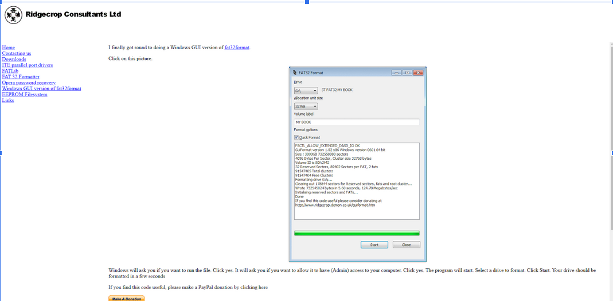

# ethan-zeichner-portfolio
Purpose
The purpose of this document is to outline the use of Ridgecrop Consultants Ltd.’s program GUIformat. GUIformat is a versatile and easy-to-use conversion program, allowing the conversion of external drives to the FAT32 file system, beyond the 32 gigabyte storage cap imposed by Windows.

This is an unofficial guide created as a documentation exercise. I, Ethan Zeichner, am not associated with Ridgecrop Consultants Ltd. or GUIformat in any way.

Prerequisites
Windows 7, 8, 10, or 11.

An external drive with either NTFS or exFAT as its default file system.

A copy of GUIformat downloaded from Ridgecrop Consultants Ltd.’s website.

Glossary
FAT32format: A Command Prompt program developed by Ridgecrop Consultants Ltd., used for formatting external drives to the FAT32 file system. Notable for allowing the formatting of drives up to two terabytes, as opposed to Windows’ own 32 gigabyte storage cap.

GUIformat: A version of FAT32format also developed by Ridgecrop, which uses the native Windows GUI, as opposed to Command Line. Intended for users who are unfamiliar with Command Prompt. Serves the same purpose as its predecessor. 

Windows: A proprietary operating system developed by Microsoft, first introduced in 1985. Has a wide range of uses, from consumer personal computers to servers and embedded services. Windows is the most widespread desktop operating system in the world, having around 80% of market share as of 2026.

Kilobyte (kb): A unit of measure for digital storage, composed of 1,024 bytes. Used for small files, such as text files or small images. 

Gigabyte (gb): A unit of measure for digital storage, composed of approximately 1 billion bytes and 1 million kilobytes. Used for larger files, such as videos or large images. 

Terabyte (tb): A unit of measure for digital storage, composed of approximately 1,000 gigabytes. Used for large-scale storage, including a computer’s internal drive, external hard drives, and cloud systems.

Exabyte (eb): A unit of measure for digital storage, composed of approximately 1,000 petabytes, 1 million terabytes, or 1 quintillion bytes. Used for large-scale data centers, scientific research, and artificial intelligence development.

Cluster: Allocation units used within the FAT storage system, the smallest possible units of disk space. The FAT table acts as a map for these clusters, writing data to a chain of these clusters.

Introduction
GUIformat is a version of the program fat32format, running on the Windows GUI, developed by Ridgecrop Consultants Ltd., a United Kingdom-based consultancy company specializing in embedded and low-level development.

As with its predecessor, GUIformat is used to format external drives, such as Solid State Drives or flash drives, into the FAT32 (File Allocation Table 32) format, for use in non-Windows operating systems, legacy systems, digital cameras, and video game consoles, among others.

While Windows does offer native formatting to FAT32, this process includes a 32 gigabyte storage cap for the targeted drive, disallowing drives above 32gb to be formatted. GUIformat bypasses this cap, allowing drives with up to 2 terabytes of storage to be formatted. 

Background
The File Allocation Table (FAT), is a file system developed by Bill Gates and Marc McDonald at Microsoft in 1977 or 1978 using 8-bit data entries for 8-inch floppy disks used in an Intel-8080 microprocessor-based successor to the NCR 7200 Model VI data-entry terminal. 

FAT32 is a version of the File Allocation Table file system, developed by Microsoft in 1996 for use in the Windows 9x family of operating systems, including Windows 95, Windows 98, and Windows Millennium Edition. As the name implies, cluster values are represented by 32-bit numbers. Due to the use of 32-bit numbers, FAT32 includes a strict 4 gigabyte limit for files. 

Extensible File Allocation Table (exFAT), was introduced by Microsoft in 2006, for use with devices utilizing flash memory, such as Solid State Drives (SSD), flash drives, and SD cards, among others. exFAT has a theoretical file size limit of 16 exobytes (16,000,000 terabytes), far surpassing the 4 gigabyte limit of FAT32. exFAT was proprietary to Microsoft until 2019, when its specifications were published.

In Windows operating systems, FAT was replaced with the NT File System (NTFS), with the release of Windows XP in 2001. NTFS is designed for use on the Windows NT family of operating systems, and remains the default file system for system (C:) drives on Windows 10 and Windows 11. NTFS is notable as a “journaling” file system, creating a log of intended changes before application, making the system more secure against data corruption from system crashes or improper ejection.

Despite advancements in file system technology, FAT32 is still widely used in external drives due to its extreme compatibility with older devices, including with non-Windows operating systems such as macOS, Linux, Android, and proprietary operating systems used by devices such as digital cameras and game consoles. FAT32 is sometimes considered to be the universal file system due to this fact.

Guide
- Use your internet browser of choice to navigate to Ridgecrop's website.
- Be sure not to download the program from guiformat.io, which charges $20 for a "premium edition” which includes a lifetime license and formatting above 32gb.
- The version of GUIformat hosted on Ridgecrop Ltd.’s website is completely free and allows for formatting above 32gb alongside not requiring a license. 

